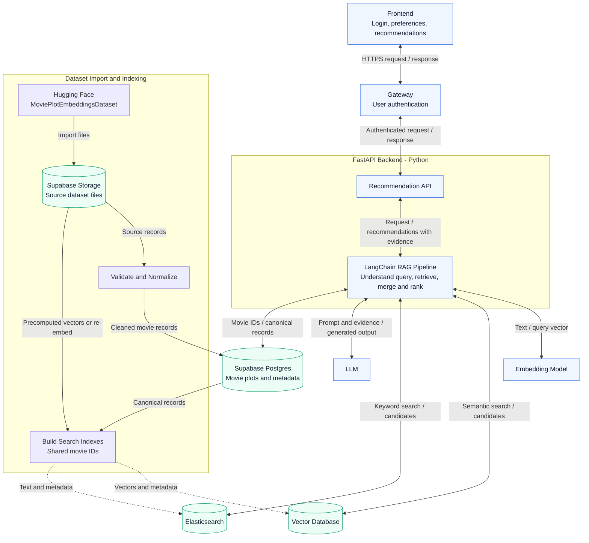

# Project plan

## Objective

Build a web application that translates natural-language movie preferences into ranked recommendations supported by retrieved movie evidence.

## Initial scope

- Free-text requests, including comparisons to named movies and multiple preferences.
- Retrieval over movie plots and metadata available in the selected dataset.
- Ranked recommendations with movie identifiers, titles, match explanations, and supporting evidence.
- A web interface for entering requests and inspecting results.

User authentication is included in the initial scope. Long-term viewing history and streaming-service availability are outside the initial scope unless the team explicitly adds them.

## Planned application architecture

- **Frontend:** Provides the login experience, accepts movie preferences, and displays recommendations with supporting evidence. API requests go through the gateway.
- **Gateway:** Sits between the frontend and backend, validates user credentials or sessions/tokens for protected requests, rejects unauthenticated requests, and forwards authenticated requests with trusted user identity to the backend. The authentication provider and gateway implementation will be selected during implementation.
- **Backend:** Uses Python and FastAPI to implement the movie recommendation API, coordinate retrieval and LLM generation, and return ranked movies with explanations and evidence. The backend accepts user identity only through a verified gateway connection, not from arbitrary client-supplied headers, and enforces any user-specific access rules.
- **LangChain:** Runs within the FastAPI backend to orchestrate query understanding, embedding and retrieval calls, prompt construction from retrieved movie records, and LLM recommendation generation. Explanations will retain references to supporting movie records.
- **Elasticsearch:** Provides keyword and text search over movie titles, plots, genres, cast, and directors. The planned hybrid retrieval flow combines Elasticsearch results with semantic matches from the vector database, deduplicates candidates by movie ID, and ranks the merged candidates before constructing the LLM prompt. Both indexes will use the same normalized movie IDs and source records; the fusion and ranking strategy will be chosen during implementation.
- **Supabase:** Hosts the movie dataset as the source of truth. We plan to retain downloaded dataset files in Supabase Storage and load cleaned movie records into Supabase Postgres. An indexing job derives the Elasticsearch and vector indexes from these records using shared movie IDs. FastAPI reads canonical movie details and evidence from Supabase when assembling recommendations. Supabase is selected for data storage; the gateway continues to own authentication enforcement.

Standalone Markdown diagram: [System architecture](../figures/system-architecture.md).

This architecture is planned; the gateway, authentication flow, and FastAPI application have not yet been implemented.

## Planned dataset

We plan to use [Movie Plot Embeddings Dataset by NiklasAbraham on Hugging Face](https://huggingface.co/datasets/NiklasAbraham/MoviePlotEmbeddingsDataset) as the initial data source for our movie recommendation RAG pipeline.

According to the publisher's dataset card, it contains approximately 92,000 movies from 1930–2024, with plot text and metadata such as titles, genres, directors, actors, and ratings. It also provides precomputed 1024-dimensional BGE-M3 embeddings and movie identifiers for linking embeddings to metadata. These are publisher-reported details; actual row counts, field completeness, and embedding coverage still need to be verified after download.

### Initial implementation plan

1. Download the metadata CSV and inspect the schema, missing values, duplicates, and plot quality. Record the dataset revision and attribution requirements. Store source files in Supabase Storage and cleaned records in Supabase Postgres. The dataset card labels it CC BY-NC 4.0 and lists source-specific licensing requirements.
2. Start with 5,000–10,000 movies with usable plots and the metadata required for the initial demonstration, then expand after validating the pipeline.
3. Evaluate reusing the supplied dense embeddings, joining them to metadata by `movie_id` through the accompanying movie-ID array. Verify dimensions and alignment, and encode user queries using the same BGE-M3 configuration. If we choose another encoder, regenerate movie embeddings with that encoder.
4. Index the normalized movie records in Elasticsearch and store vectors with metadata in the selected vector database. Use LangChain to coordinate keyword and semantic retrieval, apply supported metadata filters, and merge and deduplicate candidates by movie ID before ranking.
5. Use an LLM to produce ranked recommendations grounded in retrieved records, showing plot evidence and available source links for each recommendation.

The Hugging Face viewer showed a schema mismatch during our initial review, so the planned ingestion path uses the underlying CSV and NumPy files rather than relying on the viewer's automatic schema. This is a proposed data plan; no dataset has been downloaded or validated yet.

## Milestones and completion criteria

| Milestone | Completion criteria |
| --- | --- |
| Data selection | Record the exact dataset source, revision, license, schema, missing fields, and duplicate handling |
| Retrieval baseline | Reproducible ingestion and search return movie records for a fixed set of example queries |
| RAG recommendations | Generated recommendations reference retrieved records and expose supporting evidence |
| Authentication and API | Frontend requests pass through the authentication gateway to the FastAPI backend; protected requests require valid authentication |
| Web demonstration | A user can submit a request and inspect ranked results, loading states, and useful error messages |
| Evaluation | Report measured relevance, constraint satisfaction, faithfulness, and latency with the evaluation procedure |

## Data and configuration handling

Keep API keys in local environment variables or an ignored `.env` file. Commit only placeholder configuration. Keep downloaded datasets and generated indexes out of Git; document how to obtain and rebuild them after selecting the data source.
