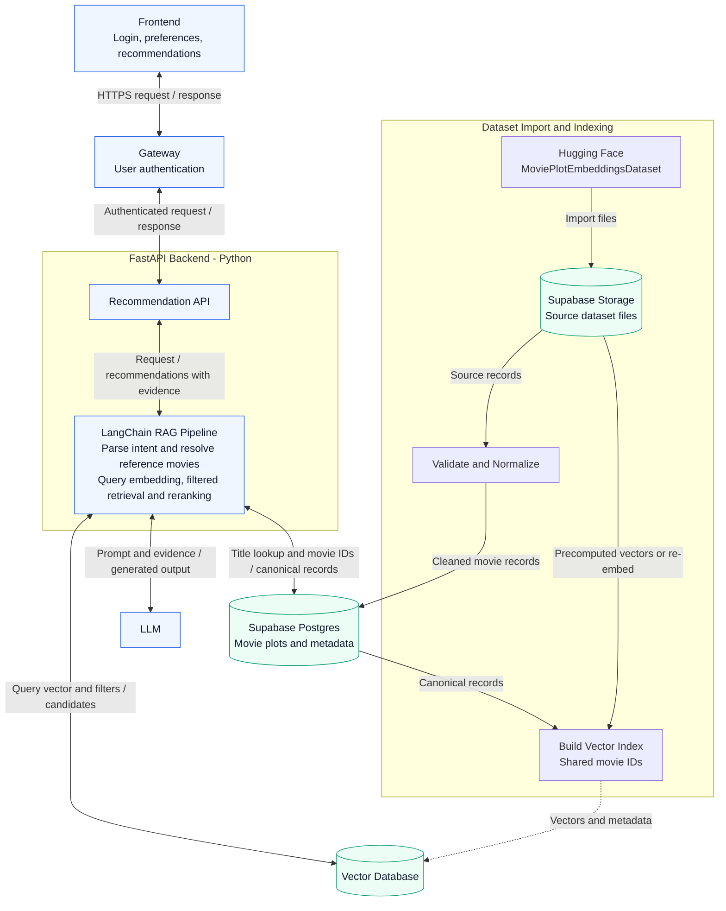

# Project plan

## Objective

Build a web application that translates natural-language movie preferences into ranked recommendations supported by retrieved movie evidence.

## Initial scope

- Free-text requests, including comparisons to named movies and multiple preferences.
- Retrieval over movie plots and metadata available in the selected dataset.
- Ranked recommendations with movie identifiers, titles, match explanations, and supporting evidence.
- A web interface for entering requests and inspecting results.

User authentication is included in the initial scope. Long-term viewing history and streaming-service availability are outside the initial scope unless the team explicitly adds them.

## Planned application architecture



- **Frontend:** Provides the login experience, accepts movie preferences, and displays recommendations with supporting evidence. API requests go through the gateway.
- **Gateway:** Sits between the frontend and backend, validates user credentials or sessions/tokens for protected requests, rejects unauthenticated requests, and forwards authenticated requests with trusted user identity to the backend. The authentication provider and gateway implementation will be selected during implementation.
- **Backend:** Uses Python and FastAPI to implement the movie recommendation API, coordinate retrieval and LLM generation, and return ranked movies with explanations and evidence. The backend accepts user identity only through a verified gateway connection, not from arbitrary client-supplied headers, and enforces any user-specific access rules.
- **LangChain:** Runs within FastAPI to parse user intent, resolve reference movies, encode semantic queries, retrieve candidates with metadata filters, and rerank them against the user's preferences. It coordinates LLM calls for intent extraction and evidence-grounded recommendation generation. Query embedding is an internal retrieval step, not a separate application service.
- **Retrieval:** The first version uses vector search with structured metadata filters. Movie titles, actors, and directors can be looked up or filtered through database queries. Elasticsearch is outside the initial implementation scope; it can be reconsidered if testing reveals a need for dedicated keyword search.
- **Supabase:** Hosts the movie dataset as the source of truth. We plan to retain downloaded dataset files in Supabase Storage and load cleaned movie records into Supabase Postgres. An indexing job derives the vector index from these records using shared movie IDs. FastAPI reads canonical movie details and evidence from Supabase when assembling recommendations. Supabase is selected for data storage; the gateway continues to own authentication enforcement.

Standalone Markdown diagram: [System architecture](../figures/system-architecture.md).

This architecture is planned; the gateway, authentication flow, and FastAPI application have not yet been implemented.

## User input processing and recommendation flow

1. **Parse intent.** Use an LLM to extract a semantic query, reference movie title (if any), hard filters, and soft preferences. Validate the structured output in FastAPI against allowed fields, types, and operators before building database queries. Preserve the original request for the final preference check.
2. **Resolve reference movies.** Look up named movies in Supabase and read their actual plots and metadata. Ask for clarification when a title is ambiguous or cannot be resolved reliably; do not invent a reference plot.
3. **Build the semantic query.** Combine the user's desired themes with relevant evidence from the reference movie. Emphasize the requested aspects rather than copying the entire reference plot. Keep hard constraints and negative preferences separately so they are not lost in the embedding.
4. **Embed and retrieve.** Encode the semantic query using the same model and compatible settings as the indexed movie text. If reusing the dataset's BGE-M3 vectors, match their encoding configuration. Apply supported hard filters during retrieval, exclude the resolved reference movie when appropriate, and deduplicate plot chunks by movie ID. Start with approximately 20 candidate movies as a tunable setting.
5. **Check constraints and rerank.** Load canonical records from Supabase, recheck hard constraints, and rank eligible candidates against soft preferences using their plot evidence. An unknown metadata value does not establish that a hard constraint is satisfied. Do not silently relax explicit requirements when too few candidates qualify.
6. **Generate recommendations.** Ask the LLM to select up to five eligible candidates and explain the matches using retrieved evidence. Return valid candidate movie IDs and supporting fields or plot excerpts, and validate the response against the candidate set. These candidate and output counts are initial settings to tune during development.

For example, “similar to Interstellar, but with less science fiction and more focus on family relationships” could initially produce:

```json
{
  "reference_title": "Interstellar",
  "semantic_query": "Family bonds and parent-child relationships",
  "hard_filters": {},
  "soft_preferences": {
    "prefer": ["family relationships"],
    "avoid": ["heavy science-fiction elements"]
  },
  "exclude_reference_movie": true
}
```

“Less science fiction” is a soft preference, while “no science-fiction movies” is an explicit genre exclusion. “At most two hours” becomes a maximum runtime of 120 minutes. Additional themes such as sacrifice or reunion should only enter the query when supported by the user request or the resolved reference record. Vector similarity supplies candidates; it does not by itself guarantee that negation or other constraints are satisfied.

## Planned dataset

[Movie Plot Embeddings Dataset on Hugging Face](https://huggingface.co/datasets/NiklasAbraham/MoviePlotEmbeddingsDataset)

### Preprocessing plan — In Progress

1. Remove duplicate movie records and exclude entries missing a title or usable plot. Keep missing optional metadata as null rather than inventing values.
2. Clean plot text by removing formatting artifacts and normalizing whitespace. Standardize movie IDs, release dates, genres, cast, and director fields.
3. Create retrieval documents from the cleaned plots and metadata, preserving movie IDs and source links. Split long plots into chunks linked to their original movie.
4. Reuse existing embeddings only when they match the indexed text and movie IDs; generate new embeddings for modified text or new chunks using a consistent encoder.
5. Store source files in Supabase Storage and cleaned records in Supabase Postgres, then build the vector index using shared movie IDs.

## Milestones and completion criteria

| Milestone | Completion criteria |
| --- | --- |
| Data selection | Record the exact dataset source, revision, license, schema, missing fields, and duplicate handling |
| Retrieval baseline | Reproducible ingestion and search return movie records for a fixed set of example queries |
| RAG recommendations | Generated recommendations reference retrieved records and expose supporting evidence |
| Authentication and API | Frontend requests pass through the authentication gateway to the FastAPI backend; protected requests require valid authentication |
| Web demonstration | A user can submit a request and inspect ranked results, loading states, and useful error messages |
| Evaluation | Report measured relevance, constraint satisfaction, faithfulness, and latency with the evaluation procedure |

## Data and configuration handling

Keep API keys in local environment variables or an ignored `.env` file. Commit only placeholder configuration. Keep downloaded datasets and generated indexes out of Git; document how to obtain and rebuild them after selecting the data source.
