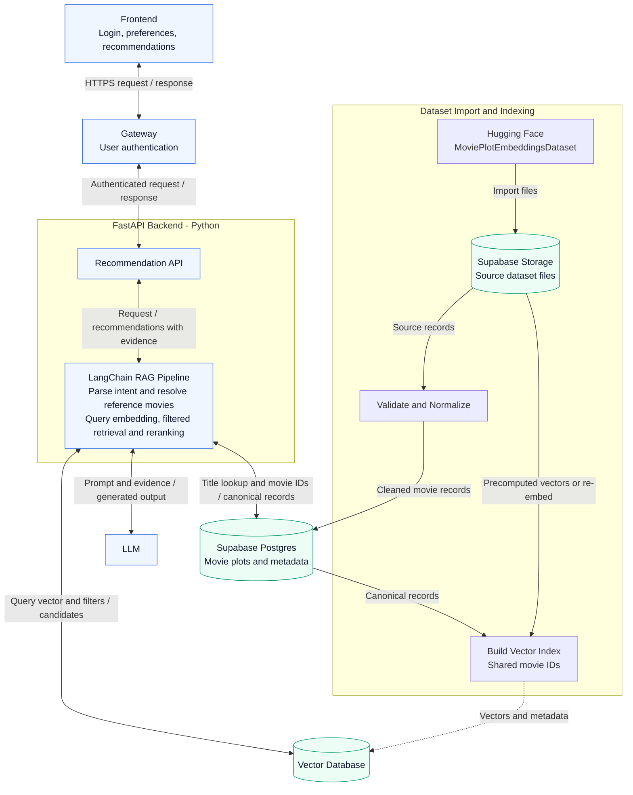

# V Me 50 - System Architecture

Proposed architecture; not yet implemented. The gateway handles authentication, FastAPI hosts the LangChain RAG pipeline, and Supabase stores the dataset. LangChain parses user intent, resolves reference movies, embeds the semantic query, retrieves candidates with metadata filters, and reranks them using the original preferences. Query embedding is part of the backend retrieval flow. The first version uses vector retrieval without Elasticsearch.

