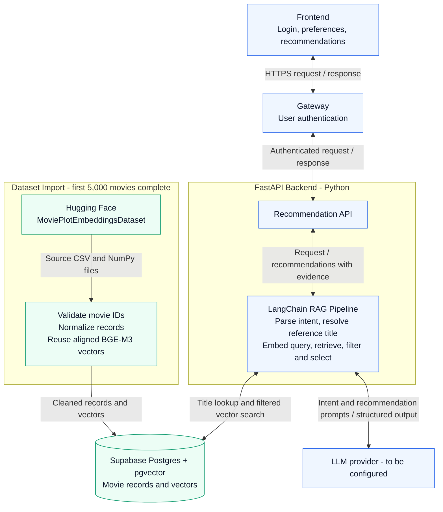

# V Me 50 - System Architecture

The first 5,000 movie records and BGE-M3 vectors are in Supabase Postgres. The LangChain core and FastAPI router are implemented. Gateway authentication, frontend, and LLM credentials remain to be integrated.

```mermaid
flowchart TB
    frontend["Frontend<br/>Login, preferences, recommendations"]
    gateway["Gateway<br/>User authentication"]
    subgraph backend["FastAPI Backend - Python"]
        api["Recommendation API"]
        chain["LangChain RAG Pipeline<br/>Parse intent, resolve reference title<br/>Embed query, retrieve, filter and select"]
        api <-->|Request / recommendations with evidence| chain
    end
    frontend <-->|HTTPS request / response| gateway
    gateway <-->|Authenticated request / response| api
    chain <-->|Title lookup and filtered vector search| postgres[("Supabase Postgres + pgvector<br/>Movie records and vectors")]
    chain <-->|Intent and recommendation prompts / structured output| llm["LLM provider - to be configured"]

    subgraph ingestion["Dataset Import - first 5,000 movies complete"]
        dataset["Hugging Face<br/>MoviePlotEmbeddingsDataset"]
        clean["Validate movie IDs<br/>Normalize records<br/>Reuse aligned BGE-M3 vectors"]
        dataset -->|Source CSV and NumPy files| clean
    end
    clean -->|Cleaned records and vectors| postgres

    classDef service fill:#eff6ff,stroke:#2563eb,color:#0f172a
    classDef data fill:#ecfdf5,stroke:#059669,color:#0f172a
    class frontend,gateway,api,chain,llm service
    class postgres,dataset,clean data
```
